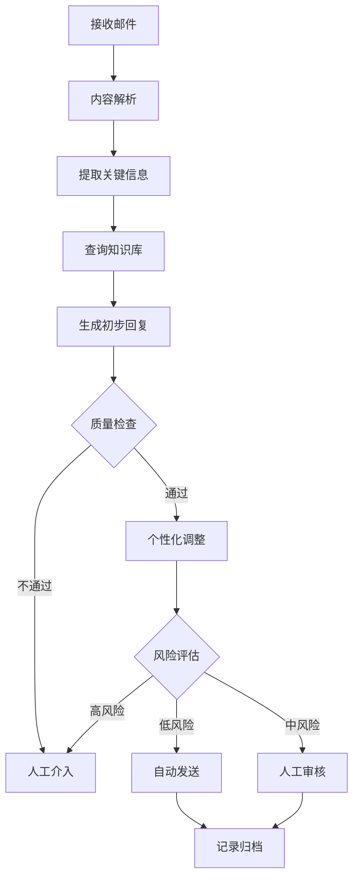

# 外贸邮件AI智能处理系统 - 完整解决方案

## 一、系统架构设计

### 1.1 核心模块划分

```
┌─────────────────────────────────────────────────────────┐
│                    邮件接收层                              │
│         (IMAP/POP3/API 多邮箱账户集成)                    │
└────────────────────┬────────────────────────────────────┘
                     ↓
┌─────────────────────────────────────────────────────────┐
│                 AI智能分析引擎                             │
│  ├─ 邮件分类  ├─ 意图识别  ├─ 客户画像  ├─ 情感分析      │
└────────────────────┬────────────────────────────────────┘
                     ↓
┌─────────────────────────────────────────────────────────┐
│                 知识库管理系统                             │
│  ├─ 产品库  ├─ 价格体系  ├─ 案例库  ├─ 话术库            │
└────────────────────┬────────────────────────────────────┘
                     ↓
┌─────────────────────────────────────────────────────────┐
│              AI回复生成与审核系统                          │
│  ├─ 个性化回复  ├─ 多语言支持  ├─ 人工审核                │
└────────────────────┬────────────────────────────────────┘
                     ↓
┌─────────────────────────────────────────────────────────┐
│                CRM客户管理系统                             │
│  ├─ 跟进记录  ├─ 订单管理  ├─ 客户分级                    │
└─────────────────────────────────────────────────────────┘
```

## 二、邮件智能分类系统

### 2.1 一级分类（按业务阶段）

| 类别 | 说明 | AI处理策略 |
|------|------|-----------|
| **新客询盘** | 首次联系的潜在客户 | 优先级：高，快速响应（1小时内） |
| **报价跟进** | 已报价等待回复 | 主动跟进，提供额外价值信息 |
| **样品阶段** | 讨论或已寄送样品 | 关注物流，询问反馈 |
| **谈判议价** | 价格/条款谈判中 | 灵活应对，记录底线 |
| **订单确认** | 准备下单或已下单 | 精准执行，避免错误 |
| **生产跟踪** | 订单生产中 | 定期更新进度 |
| **售后服务** | 投诉/质量/退换货 | 紧急处理，人工介入 |
| **老客维护** | 定期关系维护 | 温馨问候，新品推荐 |
| **垃圾/营销** | 无关邮件 | 自动过滤/归档 |

### 2.2 二级分类（按询问内容）

- 产品信息类（规格、材质、工艺）
- 价格询问类（FOB/CIF/EXW报价）
- 定制需求类（OEM/ODM服务）
- 样品申请类（付费/免费样品）
- 认证资质类（证书、检测报告）
- 物流运输类（货期、运费、方式）
- 付款方式类（T/T、L/C、PayPal）
- 起订量类（MOQ谈判）
- 售后问题类（质量投诉、退货）

### 2.3 客户意图识别（深度分析）

```python
意图识别维度：
├─ 购买意愿强度：高/中/低（通过语气、细节问题判断）
├─ 预算水平：高端/中端/低端（通过要求推断）
├─ 紧急程度：急单/常规/长期计划
├─ 决策权限：决策者/采购员/询价员
├─ 竞争状态：独家询价/多家比价
└─ 客户类型：批发商/零售商/品牌商/贸易公司
```

## 三、客户全生命周期管理

### 3.1 客户分级体系

**A级客户（重点大客户）**
- 特征：年采购额>$50K，长期合作
- AI策略：人工+AI混合模式，重大决策人工审核
- 响应时间：30分钟内
- 专属服务：价格优惠、专人对接、定期回访

**B级客户（成长型客户）**
- 特征：有过订单，年采购$10K-$50K
- AI策略：AI主导，定期人工检查
- 响应时间：1小时内
- 服务内容：新品推送、节日问候

**C级客户（潜力客户）**
- 特征：高质量询盘，未成交
- AI策略：AI自动化跟进
- 响应时间：2小时内
- 培育策略：定期发送案例、行业资讯

**D级客户（普通询盘）**
- 特征：首次询价，信息不详
- AI策略：完全自动化
- 响应时间：4小时内

### 3.2 客户画像构建

```json
{
  "客户ID": "C2024001",
  "基础信息": {
    "公司名": "ABC Trading Ltd.",
    "国家": "美国",
    "联系人": "John Smith",
    "职位": "采购经理",
    "邮箱": "john@abctrading.com"
  },
  "行为数据": {
    "首次联系时间": "2024-01-15",
    "邮件往来次数": 23,
    "平均响应时间": "3小时",
    "打开率": "85%",
    "访问网站次数": 12
  },
  "交易数据": {
    "历史订单数": 5,
    "总采购金额": "$45,000",
    "平均订单金额": "$9,000",
    "最常购产品": "男士平角内裤",
    "付款方式": "T/T 30%预付",
    "信用评级": "良好"
  },
  "偏好分析": {
    "价格敏感度": "中",
    "关注重点": ["质量", "交期"],
    "沟通风格": "专业高效",
    "决策周期": "2-3周"
  }
}
```

## 四、AI知识库建设（核心竞争力）

### 4.1 产品知识库结构

```
产品知识库/
├─ 男士内裤系列/
│   ├─ 平角内裤/
│   │   ├─ 产品规格表.xlsx
│   │   ├─ 材质说明（棉/莫代尔/竹纤维）
│   │   ├─ 尺码对照表（S-XXXL）
│   │   ├─ 工艺介绍（无缝/四角裤头）
│   │   ├─ 高清产品图（6视角）
│   │   ├─ 价格体系（阶梯报价）
│   │   └─ 常见问题FAQ
│   ├─ 三角内裤/
│   └─ 运动内裤/
│
├─ 定制服务/
│   ├─ 印花工艺（数码印/丝网印/热转印）
│   ├─ 刺绣选项（位置、尺寸、起订量）
│   ├─ 标签定制（主唛/洗唛/吊牌）
│   ├─ 包装定制（OPP袋/彩盒/礼盒）
│   └─ 定制流程与周期
│
├─ 认证资质/
│   ├─ OEKO-TEX认证
│   ├─ BSCI社会责任认证
│   ├─ ISO9001质量体系
│   ├─ 各国检测报告（EU/US标准）
│   └─ 工厂审核报告
│
└─ 成功案例库/
    ├─ 欧美市场案例（配图）
    ├─ 电商平台供应案例
    ├─ 品牌合作案例（需脱敏）
    └─ 客户评价testimonial
```

### 4.2 动态价格体系

```python
价格计算逻辑：
基础价格 = 
    原材料成本 + 人工成本 + 包装成本 + 管理费用 + 利润

动态调整因素：
├─ 订单数量折扣（阶梯价）
│   1000-5000件：基础价
│   5001-10000件：-5%
│   10001+件：-8%
├─ 定制复杂度加价
│   纯色基本款：+0%
│   单色印花：+15%
│   多色印花：+25%
│   刺绣：+30%
├─ 材质差异
│   普通棉：基准价
│   精梳棉：+20%
│   莫代尔：+35%
│   竹纤维：+40%
├─ 季节性调整
│   旺季（9-12月）：+5%
│   淡季（3-5月）：-10%促销
└─ 客户等级折扣
    A级：额外-5%
    B级：额外-3%
```

### 4.3 话术模板库（分场景）

**首次询盘回复模板**
```
Dear [客户名],

Thank you for your interest in our men's underwear products!

I'm [AI名称], your dedicated sales consultant at [公司名]. We specialize in 
high-quality men's underwear manufacturing with 15+ years of experience, 
serving clients in 50+ countries.

Regarding your inquiry about [具体产品], I'd like to share:

✓ Product Options: [列出3-4个推荐款式]
✓ Customization: Full OEM/ODM services available
✓ MOQ: As low as 1000 pieces per design
✓ Lead Time: 25-30 days after order confirmation
✓ Quality Assurance: OEKO-TEX certified, EU standard compliant

To provide you with an accurate quotation, could you please clarify:
1. Target quantity per style/color?
2. Preferred fabric (cotton/modal/bamboo)?
3. Any customization needs (logo, packaging)?

I've attached our latest catalog for your reference. Looking forward to 
building a long-term partnership with you!

Best regards,
[AI签名]
[联系方式]
```

## 五、智能回复生成系统

### 5.1 回复生成流程



### 5.2 个性化要素

1. **语言风格匹配**
   - 检测客户邮件的正式程度
   - 匹配相应的回复语气（专业/友好/简洁）

2. **文化适配**
   - 欧美客户：直接、高效、重视数据
   - 中东客户：建立关系、价格敏感
   - 日韩客户：重视细节、严谨
   - 南美客户：热情、需要耐心跟进

3. **时区智能**
   - 根据客户时区选择发送时间
   - 避免周末/节假日发送

### 5.3 多语言支持

- **主要语言**：英语、西班牙语、法语、德语、日语、阿拉伯语
- **翻译质量**：行业术语库 + AI翻译 + 人工校验
- **本地化**：单位换算、日期格式、文化禁忌

## 六、关键外贸流程的AI处理方案

### 6.1 询盘阶段（Inquiry）

**AI任务清单：**
- [ ] 1小时内首次回复
- [ ] 分析客户背景（领英、公司网站）
- [ ] 提供产品目录和基础价格范围
- [ ] 询问具体需求（数量、定制、交期）
- [ ] 提出3个引导性问题推进对话
- [ ] 添加社交证明（案例/认证）

**自动化操作：**
```python
if 首次询盘:
    发送欢迎邮件 + 公司介绍 + 产品目录
    标记为"待跟进"
    24小时后自动催促反馈
    在CRM创建客户档案
```

### 6.2 报价阶段（Quotation）

**智能报价生成器**
```
输入参数：
- 产品型号：MU-001 (平角内裤)
- 数量：5000件
- 材质：精梳棉
- 定制：单色丝印logo
- 包装：OPP袋 + 吊牌

AI计算输出：
┌─────────────────────────────────────┐
│          QUOTATION                   │
│  Valid until: [30天后日期]           │
├─────────────────────────────────────┤
│ Item: Men's Boxer Briefs MU-001     │
│ Fabric: 95% Combed Cotton + 5% Spandex│
│ Quantity: 5,000 pcs                  │
│ Customization: 1-color screen print  │
│                                       │
│ Unit Price: $2.85/pc (FOB Shanghai)  │
│ Total Amount: $14,250                │
│                                       │
│ MOQ: 1,000 pcs per color             │
│ Lead Time: 28 days                   │
│ Payment: 30% T/T deposit, 70% before│
│          shipment                     │
│ Validity: 30 days                    │
└─────────────────────────────────────┘

附加价值内容：
- 免费打样（仅付快递费）
- 质量检验报告
- 下单即赠送500个包装袋
```

**AI议价策略**
```python
if 客户说"价格太高":
    策略1: 展示价值（质量对比、认证、服务）
    策略2: 询问目标价格
    策略3: 提供数量折扣选项
    策略4: 推荐性价比更高的替代方案
    底线: 不低于成本价+15%利润

if 客户提出目标价:
    差距 = 我方报价 - 客户目标价
    if 差距 < 10%:
        提出折中方案（调整定制程度/包装）
    elif 差距 > 20%:
        了解客户预算是否真实
        分析是否值得继续跟进
```

### 6.3 样品阶段（Sampling）

**自动化流程：**
1. 客户申请样品
2. AI确认：
   - 样品款式和数量
   - 寄送地址
   - 快递方式选择（DHL/FedEx/UPS）
   - 样品费和运费确认
3. 生成PI（形式发票）
4. 收到付款后通知生产部门
5. 发货后自动发送快递单号
6. 跟踪物流状态
7. 到达后主动询问反馈

**样品反馈跟进模板：**
```
Day 1（发货当天）: 发送快递单号和跟踪链接
Day 3: 询问是否收到包裹
Day 4: "How do you like the samples? Any questions?"
Day 7: 提供详细对比分析（如有竞品样）
Day 10: "Are you ready to place an order?"
```

### 6.4 订单确认阶段（Order Confirmation）

**关键检查点（AI必须确认）：**
- [ ] 产品规格无误（型号、颜色、尺码比例）
- [ ] 数量准确
- [ ] 定制细节（logo文件、位置、尺寸）
- [ ] 包装要求
- [ ] 交货期可行性
- [ ] 付款条款
- [ ] 运输方式和目的港

**自动生成文档：**
1. PI（Proforma Invoice）
2. 订单确认书（Order Confirmation）
3. 生产通知单（内部）

**风险提示：**
```python
if 大额订单 or 新客户:
    提示人工审核付款方式
  
if 交期紧急:
    确认工厂产能和档期
  
if 定制复杂:
    要求客户签字确认设计稿
```

### 6.5 生产跟进阶段（Production）

**自动化进度播报：**
```
Timeline自动通知：
├─ Day 1: 订单已进入生产排期
├─ Day 7: 面料已采购完成
├─ Day 14: 大货生产中（附生产现场照片）
├─ Day 21: 生产完成80%
├─ Day 25: 质检中（附检验照片）
├─ Day 28: 包装完成，准备出货
└─ Day 30: 已安排出运

每次通知附带：
- 实景照片（自动从工厂系统抓取）
- 预计完成时间
- 是否需要客户采取行动
```

### 6.6 出货跟踪阶段（Shipment）

**物流信息管理：**
- 自动生成装箱单（Packing List）
- 商业发票（Commercial Invoice）
- 原产地证（C/O）- 如需要
- 提单（B/L）扫描件发送
- 实时物流跟踪推送
- 预计到港时间提醒

**主动服务：**
```
出货后：发送所有文件扫描件
海运中：每周更新船期
到港前3天：提醒准备清关
到港后：询问清关是否顺利
```

### 6.7 售后服务阶段（After-sales）

**质量问题处理流程：**
```
1. 客户投诉 → AI立即响应（1小时内）
2. 详细了解问题（照片、视频、数量）
3. 分类问题严重程度
   ├─ 严重（大批量质量问题）→ 立即人工介入
   ├─ 中等（少量问题）→ AI提出解决方案
   └─ 轻微（个别瑕疵）→ AI安慰+补偿

4. 解决方案库：
   - 重做补发
   - 部分退款
   - 下次订单折扣补偿
   - 提供维修指导

5. 记录归档，改进生产流程
```

### 6.8 客户维护阶段（Retention）

**自动化触达计划：**
```
老客户维护日历：
├─ 每月1日：发送新品资讯
├─ 每季度：发送行业报告/市场趋势
├─ 订单后30天：满意度调查
├─ 订单后90天：复购提醒
├─ 客户生日：祝福邮件+专属优惠
├─ 重大节日：节日问候
└─ 长期未下单（6个月）：赢回邮件

个性化内容：
- 根据历史采购推荐相关产品
- 分享客户所在市场的成功案例
- 邀请参加展会/工厂参观
```

## 七、智能跟进系统

### 7.1 自动跟进策略

**跟进时间表：**
```
首次询盘未回复：
├─ 24小时后：第一次跟进（换个角度提供信息）
├─ 3天后：第二次跟进（分享案例/优惠）
├─ 7天后：第三次跟进（最后机会）
└─ 14天后：标记为"沉默客户"，降低优先级

报价后未回复：
├─ 3天后：询问是否收到报价
├─ 5天后：提供额外价值（技术对比/市场信息）
├─ 7天后：询问是否有疑问
└─ 10天后：提供限时优惠

样品后未回复：
├─ 收到后2天：询问样品质量
├─ 5天后：提供订单激励（首单折扣）
├─ 10天后：了解顾虑
└─ 15天后：最后跟进
```

### 7.2 智能催单术语

```
不要说："Are you still interested?"（太被动）

改说：
✓ "Just wanted to check if you received my quotation. 
   Any questions I can help clarify?"

✓ "I've reserved the production slot for your order. 
   Shall we proceed to confirmation?"

✓ "Good news! We're running a promotion this month. 
   I can offer you an extra 5% discount if you confirm by [日期]."

✓ "Many clients are preparing for [季节/节日] season now. 
   Would you like to secure your inventory early?"
```

## 八、风险控制与人工介入机制

### 8.1 必须人工审核的情况

```python
自动触发人工审核规则：
├─ 订单金额 > $10,000
├─ 新客户首单 > $5,000
├─ 客户要求更改银行账户
├─ 要求特殊付款方式（Western Union/现金）
├─ 客户情绪负面（投诉/威胁）
├─ 要求超出标准政策（超长账期/特殊折扣）
├─ AI置信度 < 80%
├─ 涉及法律/合规问题
└─ 客户要求视频会议/电话沟通
```

### 8.2 AI与人工协作模式

**模式一：AI草稿，人工审核**
- 适用：重要客户、大额订单、复杂谈判
- 流程：AI生成回复 → 发送到审核池 → 人工修改/批准 → 发送

**模式二：人工接管，AI辅助**
- 适用：VIP客户、危机处理
- 流程：人工主导沟通 → AI提供建议和资料 → AI记录归档

**模式三：完全自动化**
- 适用：常规询盘、标准流程、老客户复购
- 流程：AI全程处理 → 定期人工抽查

### 8.3 质量监控体系

```
每日监控指标：
├─ AI回复准确率（人工抽查10%）
├─ 客户满意度（回复率、转化率）
├─ 响应时间达标率
├─ 错误/投诉数量
└─ 人工干预次数

每周优化：
├─ 分析高频问题，补充知识库
├─ 优化表现不佳的模板
├─ 更新产品/价格信息
└─ 培训AI新话术
```

## 九、技术实现方案

### 9.1 技术栈建议

**前端：**
- 管理后台：React + Ant Design
- 移动端监控：React Native

**后端：**
- API服务：Node.js (Express) 或 Python (FastAPI)
- AI引擎：OpenAI GPT-4 / Claude / 本地部署LLaMA

**数据库：**
- 主数据库：PostgreSQL（客户/订单数据）
- 向量数据库：Pinecone/Milvus（知识库检索）
- 缓存：Redis

**邮件处理：**
- 收件：IMAP协议 + Gmail/Outlook API
- 发件：SMTP + SendGrid/Mailgun（提高送达率）

**其他服务：**
- 文件存储：AWS S3 / 阿里云OSS
- 队列：RabbitMQ（异步任务处理）
- 日志：ELK Stack
- 监控：Prometheus + Grafana

### 9.2 AI模型训练数据

**需要收集的数据：**
1. 历史邮件往来（至少1000组对话）
2. 成功订单案例（标注关键转化点）
3. 失败案例（分析原因）
4. 行业标准话术
5. 竞品分析资料
6. 客户反馈和评价

**数据标注工作：**
- 邮件意图标注（询价/抱怨/催货等）
- 情感倾向标注（正面/负面/中性）
- 客户等级标注
- 最佳回复示例

### 9.3 系统集成

```
对接清单：
├─ 邮箱系统（Gmail/Outlook/企业邮箱）
├─ 现有CRM（Salesforce/Zoho）
├─ ERP系统（库存/生产）
├─ 财务系统（账款管理）
├─ WhatsApp Business API
├─ 网站在线聊天（Intercom/Zendesk）
└─ 社交媒体（LinkedIn自动化）
```

## 十、进阶功能与创新想法

### 10.1 预测性销售

**AI预测模型：**
```python
预测维度：
├─ 客户下单概率（基于行为数据）
├─ 预计订单金额
├─ 最佳接触时间
├─ 流失风险预警
└─ 追加销售机会

应用场景：
- 识别"即将下单"客户，加强跟进
- 提前预警可能流失的客户
- 推荐最有可能成交的产品组合
```

### 10.2 智能销售教练

**为人工业务员提供AI辅助：**
- 实时谈判建议（在邮件界面显示提示）
- 最佳话术推荐
- 竞品对比数据
- 历史类似案例参考
- 风险提示（如：此客户曾有拖欠记录）

### 10.3 多渠道整合

```
统一客户视图：
├─ 邮件沟通记录
├─ WhatsApp聊天历史
├─ 电话通话记录（AI转文字）
├─ 视频会议纪要（自动生成）
├─ 社交媒体互动
└─ 网站访问行为

优势：
- 360度了解客户
- 跨渠道无缝衔接
- 避免重复沟通
```

### 10.4 智能内容生成

**自动创作营销内容：**
- 产品推广邮件（EDM）
- 社交媒体帖文
- 展会邀请函
- 客户案例故事
- 行业洞察报告

**个性化定制：**
- 根据客户兴趣推送内容
- A/B测试优化打开率
- 最佳发送时间智能选择

### 10.5 语音/视频功能

**AI语音助手：**
- 接听客户电话（初步筛选）
- 语音留言转文字和回复建议
- 多语言实时翻译

**AI视频生成：**
- 自动生成产品介绍视频
- 虚拟主播介绍公司/产品
- 个性化视频邮件（插入客户名称）

### 10.6 区块链与智能合约

**应用场景：**
- 订单条款自动执行（付款触发生产）
- 供应链透明化（客户可追踪生产）
- 质量保证金智能托管
- 防伪溯源（每件产品区块链标识）

### 10.7 AR/VR展示

**虚拟展厅：**
- 客户可线上3D查看产品
- VR工厂参观
- AR试穿效果（内裤可能不适用，但可展示面料质感）

### 10.8 动态定价引擎

**实时价格优化：**
```python
考虑因素：
├─ 当前库存水平（库存高→降价促销）
├─ 原材料价格波动
├─ 竞争对手价格（爬虫监控）
├─ 客户历史价格敏感度
├─ 季节性需求
└─ 工厂产能利用率

目标：
- 利润最大化
- 保持竞争力
- 提高成交率
```

### 10.9 社交媒体监控

**AI自动监控：**
- 品牌提及分析
- 竞品动态跟踪
- 行业趋势捕捉
- 潜在客户识别（发布采购需求的企业）
- 自动私信联系（合规前提下）

### 10.10 智能展会助手

**展会前：**
- AI分析参展观众名单
- 识别重点目标客户
- 生成个性化邀请函
- 预约会议日程

**展会中：**
- 名片扫描即时建档
- 实时翻译对话
- 自动记录客户需求
- 生成会后跟进任务

**展会后：**
- 48小时内发送感谢信+资料
- 分优先级安排跟进
- 生成展会ROI报告

## 十一、数据安全与合规

### 11.1 数据保护

```
安全措施：
├─ 邮件内容加密存储
├─ 客户信息访问权限控制
├─ 定期数据备份（异地）
├─ 敏感信息脱敏（如银行账号）
├─ 操作日志审计
└─ GDPR/CCPA合规
```

### 11.2 AI伦理

**透明度：**
- 在邮件签名标注"AI辅助回复"
- 客户有权要求人工接待
- 明确哪些决策由AI做出

**避免偏见：**
- 定期审查AI是否对某些国家/客户有偏见
- 确保公平对待所有客户

## 十二、实施路线图

### Phase 1: MVP（3个月）
- [ ] 邮件收发基础功能
- [ ] 简单分类（5大类）
- [ ] 知识库搭建（核心产品）
- [ ] 基础模板回复
- [ ] 人工审核所有回复

**预期成果：处理50%常规询盘**

### Phase 2: 进阶自动化（3-6个月）
- [ ] 复杂意图识别
- [ ] CRM集成
- [ ] 客户画像系统
- [ ] 智能跟进
- [ ] 多语言支持（3种）

**预期成果：自动化率达70%**

### Phase 3: 智能化升级（6-12个月）
- [ ] 预测性分析
- [ ] 动态定价
- [ ] 多渠道整合
- [ ] 语音功能
- [ ] 移动端App

**预期成果：完整智能销售生态**

### Phase 4: 生态拓展（12个月+）
- [ ] AR/VR功能
- [ ] 区块链应用
- [ ] 行业解决方案输出（做成SaaS产品）

## 十三、成本与收益分析

### 13.1 投入成本（年）

| 项目 | 金额（USD） | 说明 |
|------|------------|------|
| **开发成本** | $50,000 | 外包或内部团队 |
| **AI API费用** | $6,000 | GPT-4 API，月500美元 |
| **服务器托管** | $3,600 | 云服务器 |
| **邮件服务** | $1,200 | SendGrid等 |
| **数据库/存储** | $2,400 | |
| **维护升级** | $12,000 | 月均1000美元 |
| **培训费用** | $5,000 | 团队使用培训 |
| **其他工具** | $3,000 | CRM/监控等 |
| **总计** | **$83,200** | 首年投入 |

### 13.2 预期收益

**效率提升：**
- 原需3-5个业务员 → 1个业务员+AI
- 人力成本节省：$60,000/年（2个业务员工资）
- 响应速度提升80%，转化率提升30%

**业绩增长：**
- 更快响应→更高询盘转化率（+30%）
- 自动跟进→减少客户流失（+25%）
- 老客户维护→复购率提升（+40%）

**假设原年销售额$500K：**
- 新增销售：$500K × 30% = $150K
- 利润率20%：$30K额外利润
- 总收益：节省$60K + 新增利润$30K = **$90K/年**

**ROI：($90K - $83K) / $83K = 8.4%（首年）**
**第二年起（无开发成本）：ROI > 150%**

## 十四、成功案例参考

### 案例1：服装外贸公司A
- 实施前：5个业务员，年处理3000个询盘，转化率8%
- 实施后：2个业务员+AI，年处理5000个询盘，转化率12%
- 成果：销售额增长50%，人力成本降低40%

### 案例2：电子产品出口商B
- 痛点：客户遍布全球，时差导致响应慢
- 方案：24/7 AI自动回复，紧急情况推送手机
- 成果：客户满意度从75%提升到92%

## 十五、关键成功因素

1. **高质量知识库**：垃圾进垃圾出，知识库决定AI水平
2. **持续优化**：每周审查AI表现，不断改进
3. **团队配合**：业务员需适应新工作方式，从"全能"到"管理者"
4. **客户教育**：让客户接受AI服务（强调更快响应）
5. **数据积累**：使用越久，AI越聪明
6. **保持人性化**：不能让客户觉得在和机器对话
7. **合规透明**：遵守各国邮件营销法规

## 十六、潜在挑战与应对

| 挑战 | 应对方案 |
|------|---------|
| 客户不信任AI | 强调人工监督，提供人工选项 |
| AI理解错误 | 建立纠错机制，快速人工接管 |
| 技术故障 | 备用方案，关键客户预警 |
| 数据安全担忧 | 通过安全认证，保险覆盖 |
| 员工抵触 | 强调AI是助手不是替代，培训新技能 |
| 初期投资大 | 分阶段实施，先做MVP验证 |

## 十七、系统监控面板（Dashboard）

```
实时监控指标：
┌────────────────────────────────────┐
│  今日数据（实时更新）               │
├────────────────────────────────────┤
│ 📧 新邮件：23封                     │
│ 🤖 AI自动处理：19封（82.6%）       │
│ 👤 人工审核：4封                    │
│ ⚡ 平均响应时间：23分钟             │
│ ✅ 客户满意度：4.7/5               │
│ 💰 新增询盘价值：$12,450           │
└────────────────────────────────────┘

客户漏斗：
询盘(100) → 报价(75) → 样品(30) → 订单(8)
转化率：询盘→订单 = 8%

待处理任务（优先级排序）：
🔴 A级客户ABC公司48小时未回复（自动提醒）
🟡 报价单#12345等待3天，建议跟进
🟢 5个客户样品已到达，等待反馈
```

---

## 总结：系统核心价值

这套系统的本质是：**用AI放大优秀业务员的能力**

✅ **速度**：客户邮件几分钟内得到专业回复
✅ **一致性**：不会因为心情/疲劳影响服务质量
✅ **记忆**：永不忘记客户信息和历史往来
✅ **学习**：不断从成功案例中学习优化
✅ **全天候**：24/7工作，覆盖所有时区
✅ **规模化**：同时处理数百个客户不会降低质量

**最终目标**：让AI成为永不疲倦的超级业务员，让人类专注于战略决策和高价值客户关系建设。


